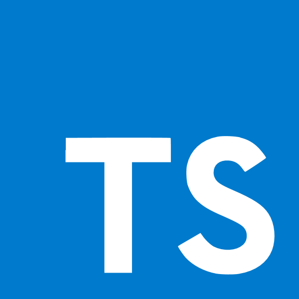

## E L L A \_ T A N T T U

WEB DEVELOPER | GRAPHIC DESIGNER
 

 
 

 
 
 
 
 

---

Hey there! I'm a professional with a background in graphic design and a recent transition into front-end web development. I've spent the majority of my career creating visually stunning designs, but now I'm excited to dive into the world of code and bring those designs to life on the web. My passion lies in making sure that the websites I build are accessible to everyone, and I'm currently working with some awesome technologies like Next.js, Craft, and GraphQL to make that happen. I'm also always looking to improve my skills, so I'm currently honing my abilities in TypeScript. I'm excited to continue growing as a developer and creating inclusive digital experiences for all users.

 
[EPICODUS PROJECT PORTFOLIO](https://ellajtanttu.github.io/epicodus-portfolio/) | [GRAPHIC DESIGN PORTFOLIO](https://www.ellatanttudesign.com/)
